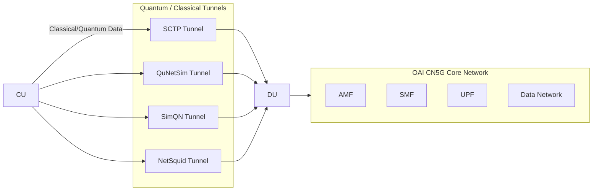

````markdown
# Quantum-Ready OAI CN5G

This repository extends the [OAI CN5G](https://gitlab.eurecom.fr/oai/cn5g/oai-cn5g-fed) core network setup with **quantum-ready tunnels**.  
It integrates **classical SCTP tunneling** with **quantum network simulators (QuNetSim, SimQN, NetSquid)** for experimental research on **post-quantum and quantum-assisted 5G architectures**.

---

## 🚀 Features
- Standard **OAI CN5G Core** with Docker (AMF, SMF, UPF, DN, MySQL).
- **Classical SCTP tunnel** for CU–DU communication.
- **Quantum tunnels** using:
  - [QuNetSim](https://github.com/tqsd/QuNetSim) (threaded & async modes)
  - [SimQN](https://github.com/ScQ-Cloud/SimQN)
  - [NetSquid](https://netsquid.org/)
- Support for **sequence tunneling** & delay/jitter evaluation.
- Ready for integration with **UE, DU, and CU nodes**.

---

## 📦 Prerequisites
- **OS**: Ubuntu 20.04 / 22.04  
- **Dependencies**:
  ```bash
  sudo apt update
  sudo apt install -y git docker docker-compose python3 python3-pip
````

* **Python Packages**:

  ```bash
  pip install qunetsim simqn netsquid pysctp
  ```

---

## ⚙️ Setup Instructions

### 1. Clone Repositories

```bash
# OAI CN5G Core
git clone https://gitlab.eurecom.fr/oai/cn5g/oai-cn5g-fed.git
cd oai-cn5g-fed

# Quantum Tunnel Addons
git clone https://github.com/YOUR-USERNAME/quantum-tunnel-oai.git
cd quantum-tunnel-oai
```

### 2. Start OAI Core

```bash
cd oai-cn5g-fed
docker compose up -d mysql oai-amf oai-smf oai-upf oai-ext-dn
```

### 3. Run Tunnels

#### Classical SCTP Tunnel

```bash
python3 tunnels/sctp_tunnel.py
```

#### Quantum Tunnels

* **QuNetSim**

  ```bash
  python3 tunnels/qunetsim_tunnel.py
  ```
* **SimQN**

  ```bash
  python3 tunnels/simqn_tunnel.py
  ```
* **NetSquid**

  ```bash
  python3 tunnels/netsquid_tunnel.py
  ```

### 4. Evaluation

Each tunnel implementation logs:

* RTT (First, Min, Max, Avg)
* Jitter (Avg)
* Throughput
* Mismatch Rate

---

## 📊 Flowchart



---

## 📂 Repository Structure

```
quantum-tunnel-oai/
│── tunnels/
│   ├── sctp_tunnel.py
│   ├── qunetsim_tunnel.py
│   ├── simqn_tunnel.py
│   ├── netsquid_tunnel.py
│── tests/
│   ├── traffic_generator.py
│   ├── forwarder.py
│── README.md
```

---

## 🔬 Research Context

This work enables:

* Integration of **quantum-safe communication** with 5G.
* Benchmarking **classical vs quantum tunnel performance**.
* Preparing OAI CN5G for **PQC and QKD extensions**.

---

## 📖 References

* [OAI CN5G Documentation](https://gitlab.eurecom.fr/oai/cn5g/oai-cn5g-fed)
* [QuNetSim](https://github.com/tqsd/QuNetSim)
* [SimQN](https://github.com/ScQ-Cloud/SimQN)
* [NetSquid](https://netsquid.org/)
```
